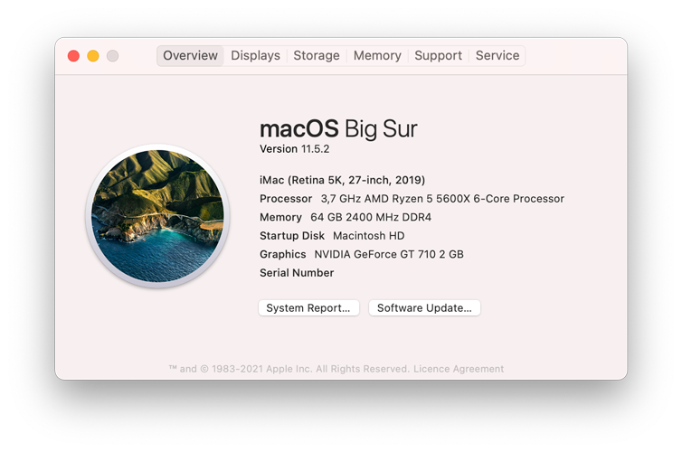

# Hackintosh • Ryzen 5600X • B550-A Pro
[OpenCore](https://dortania.github.io/OpenCore-Install-Guide) bootloader configuration for Ryzen 5 5600X on a MSI B550 A-Pro.

## Status

## Hardware

| Name     |                             Model |
| :------- | --------------------------------: |
| CPU      |                     Ryzen 5 5600x |
| GPU      |               Asus GeForce GT 710 |
| RAM      | 64GB Kingston FURY Beast DDR4-3600|
| SSD      |         Samsung 970 Evo Plus NVMe |
| Board    |                    MSI B550 A-Pro |
| Ethernet |              RTL8111H Gigabit LAN |

## Firmware
| Driver       |         Version |
| :------------| --------------: |
| [HfsPlus](https://github.com/acidanthera/OcBinaryData/blob/master/Drivers/HfsPlus.efi)      | IM201 and IM161 |
| [OpenRuntime](https://github.com/acidanthera/OpenCorePkg/releases)  |           0.7.3 |

## Kexts

| Package                    | Version |
| :------------------------- | ------: |
| [VirtualSMC](https://github.com/acidanthera/VirtualSMC/releases)                 |   1.2.7 |
| [Lilu](https://github.com/acidanthera/Lilu/releases)                       |   1.5.6 |
| [WhateverGreen](https://github.com/acidanthera/WhateverGreen/releases)              |   1.5.3 |
| [AppleALC](https://github.com/acidanthera/AppleALC/releases)                   |   1.6.4 |
| [RealtekRTL8111](https://github.com/Mieze/RTL8111_driver_for_OS_X/releases)             |   2.4.2 |
| [AirportBcrmFixup](https://github.com/acidanthera/AirportBrcmFixup/releases)           |   2.1.3 |
| [AppleMCEReporterDisabler](https://github.com/acidanthera/bugtracker/files/3703498/AppleMCEReporterDisabler.kext.zip)   |   1.2.0 |
| [NVMeFix](https://github.com/acidanthera/NVMeFix/releases)                    |   1.0.9 |
| [AMDRyzenCPUPowerManagement](https://github.com/trulyspinach/SMCAMDProcessor/releases) |     0.7 |
| [SMCAMDProcessor](https://github.com/trulyspinach/SMCAMDProcessor/releases)            |     0.7 |
| [CtlnaAHCIPort](https://github.com/dortania/OpenCore-Install-Guide/blob/master/extra-files/CtlnaAHCIPort.kext.zip)              |         |
| [USBToolBox](https://github.com/USBToolBox/kext/releases)                 |   1.1.0 |
| [UTBMap](https://github.com/USBToolBox/kext/releases)                     |     0.7 |

## SSDTs
| SSDT                     |
| :----------------------- | 
| [SSDT-CPUR](https://github.com/dortania/Getting-Started-With-ACPI/blob/master/extra-files/compiled/SSDT-CPUR.aml) |
| [SSDT-EC-USBX-DESKTOP](https://github.com/dortania/Getting-Started-With-ACPI/blob/master/extra-files/compiled/SSDT-EC-USBX-DESKTOP.aml) |

## config.plist

Based on the [Ryzen and Threadripper(17h and 19h) Guide](https://dortania.github.io/OpenCore-Install-Guide/AMD/zen.html)

#### SMBIOS

Selected: `MacPro7,1`

Please generate your own device uuid and board serial.
[Click here for details](https://dortania.github.io/OpenCore-Install-Guide/AMD/zen.html#platforminfo)

